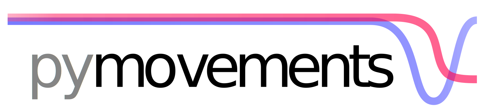

<picture>

</picture>

---

[](https://pypi.python.org/pypi/pymovements/)
[](https://pypi.python.org/pypi/pymovements/)
[](https://pypi.python.org/pypi/pymovements/)

[](https://github.com/aeye-lab/pymovements/blob/master/LICENSE)
[](https://github.com/aeye-lab/pymovements/actions/workflows/tests.yml)
[](https://pymovements.readthedocs.io/en/latest/?badge=latest)
[](https://pypistats.org/packages/pymovements)


pymovements is an open-source python package for processing eye movement data. It provides a simple
interface to download publicly available datasets, preprocess gaze data, detect oculomotoric events
and render plots to visually analyze your results.

- **Website:** https://github.com/aeye-lab/pymovements
- **Documentation:** https://pymovements.readthedocs.io
- **Source code:** https://github.com/aeye-lab/pymovements
- **Mailing list:** pymovements-list@uni-potsdam.de
- **Contributing:** https://github.com/aeye-lab/pymovements/blob/main/CONTRIBUTING.md
- **Bug reports:** https://github.com/aeye-lab/pymovements/issues
- **PyPI package:** https://pypi.org/project/pymovements


## Installation

pymovements can be installed directly from the PyPI repositories:

```bash
pip install pymovements
```

To use the latest development version or to try out tutorials, pymovements may be alternatively
cloned and installed with

```bash
git clone https://github.com/aeye-lab/pymovements.git
pip install -e ./pymovements
```


## Contributing

We welcome any sort of contribution to pymovements!

For a detailed guide, please refer to our [CONTRIBUTING.md](CONTRIBUTING.md) first.

If you have any questions, please [open an issue](
https://github.com/aeye-lab/pymovements/issues/new/choose) or write us at
[pymovements-list@uni-potsdam.de](mailto:pymovements-list@uni-potsdam.de)


## Citing

If you are using pymovements in your research, we would be happy if you cite our work by using the
following BibTex entry:

```bibtex
@misc{pymovements,
  author = {Krakowczyk, Daniel and Reich, David R. and Chwastek, Jakob, Prasse, Paul and Jäger, Lena},
  title = {pymovements: A Python Package for Processing Eye Movement Data},
  year = {2023},
  publisher = {GitHub},
  howpublished = {\url{https://github.com/aeye-lab/pymovements}},
}
```
