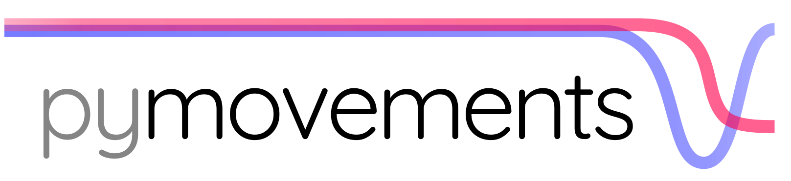

---

This is a python package for extracting oculomotoric event information from eye tracking signals.

## Contributing

We welcome any sort of contribution to pymovements!

For a detailed guide, please refer to our [CONTRIBUTING.md](CONTRIBUTING.md) first.

If you have any questions, please [open an issue](
https://github.com/aeye-lab/pymovements/issues/new/choose) or write us at
[daniel.krakowczyk@uni-potsdam.de](mailto:daniel.krakowczyk@uni-potsdam.de)
